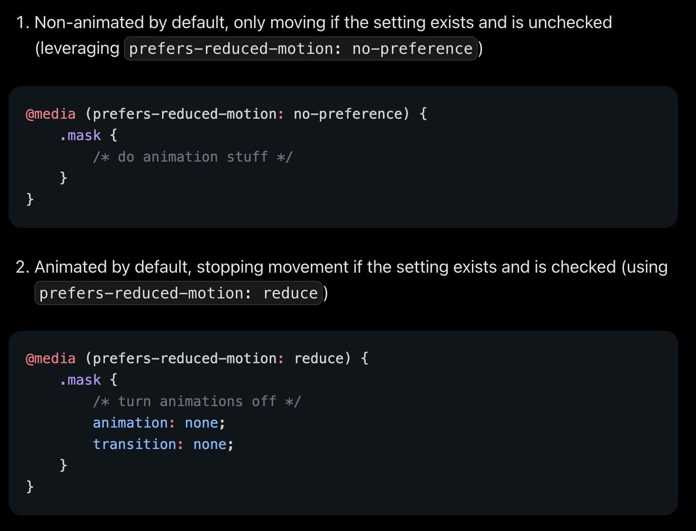

## Contrast Ratios

Regular/non-bold text < 24 px - `4.5:1`
Large text > 24 px - `4.5:1`

Non-text elements - `3:1` (buttons, icons, form controls, etc.)

[Colour Contrast Analyzer (app)](https://www.tpgi.com/color-contrast-checker/)

## Reducing Motion

CSS


JS

```jsx
const motionQuery = matchMedia("(prefers-reduced-motion: no-preference)");
```

## Prefers Color Scheme

CSS

```css
.theme-a {
  background: #dca;
  color: #731;
}

@media (prefers-color-scheme: dark) {
  .theme-a.adaptive {
    background: #753;
    color: #dcb;
    outline: 5px dashed #000;
  }
}
```

JS

```jsx
const darkModeQuery = matchMedia("(prefers-color-scheme: dark)");
```
