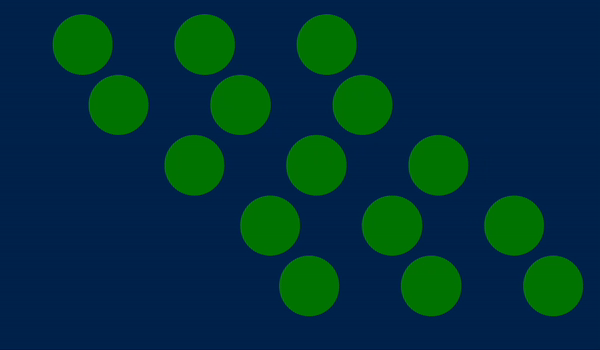

## Choreography

```css
.container {
  animation: slide-up var(--animation-duration) var(--transition-easing);
  --input-duration: calc(var(--animation-duration) / 2);
}

.container > .ui-input,
.container > .ui-button {
  animation-name: slide-up;
  animation-duration: var(--animation-duration);
  animation-timing-function: var(--transition-easing);
  animation-fill-mode: both;
}

.container > .ui-input {
  animation-delay: var(--input-duration);
}

.container > .ui-button {
  animation-delay: calc(var(--animation-duration) + var(--input-duration));
}

@keyframes slide-up {
  from {
    opacity: 0;
    transform: translateY(100%);
  }
  to {
    opacity: 1;
    transform: none;
  }
}
```


```html
<div class="balls">
  <div>
    <div class="ball" style="--i: 0"></div>
    <div class="ball" style="--i: 1"></div>
    <div class="ball" style="--i: 2"></div>
    <div class="ball" style="--i: 3"></div>
    <div class="ball" style="--i: 4"></div>
  </div>
  <div>
    <div class="ball" style="--i: 0"></div>
    <div class="ball" style="--i: 1"></div>
    <div class="ball" style="--i: 2"></div>
    <div class="ball" style="--i: 3"></div>
    <div class="ball" style="--i: 4"></div>
  </div>
  <div>
    <div class="ball" style="--i: 0"></div>
    <div class="ball" style="--i: 1"></div>
    <div class="ball" style="--i: 2"></div>
    <div class="ball" style="--i: 3"></div>
    <div class="ball" style="--i: 4"></div>
  </div>
</div>
```

```css
.balls {
  display: flex;
  gap: 3rem;
}

.ball {
  --duration: 2s;
  --stagger: 0.1s;
  --interval: calc(var(--duration) - var(--stagger));
  --easing: cubic-bezier(0.5, 0.1, 0.5, 1);

  animation: move-right var(--duration) calc(var(--interval) * var(--i) / 10)
    both var(--easing) infinite;
}

@keyframes move-right {
  0% {
    transform: translateX(0);
  }
  50% {
    transform: translateX(20vw);
  }
  100% {
    transform: translateX(0);
  }
}
```


