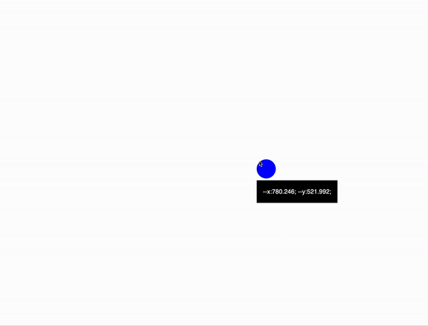
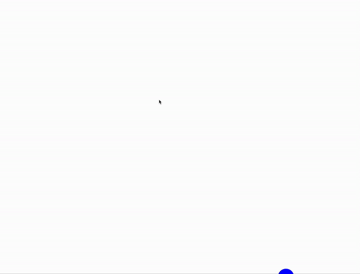

## Reactive animations

```html
<body>
  <div class="circle"></div>
</body>
<script>
  const circleEl = document.querySelector(".circle");

  document.body.addEventListener("pointermove", (event) => {
    const { clientX, clientY } = event;

    circleEl.style.setProperty("--x", clientX);
    circleEl.style.setProperty("--y", clientY);
  });
</script>
```

```css
.circle {
  --x-px: calc(var(--x) * 1px);
  --y-px: calc(var(--y) * 1px);
  height: 5vmin;
  width: 5vmin;
  border-radius: 50%;
  background-color: blue;
  transform: translate(calc(var(--x-px) - 50%), calc(var(--y-px) - 50%));
}

.circle::before {
  content: attr(style);
  background: black;
  color: white;
  padding: 1rem;
  position: absolute;
  top: 110%;
  left: 0;
  white-space: nowrap;
}
```



### Lerp technique

```html
<script>
  const circleEl = document.querySelector(".circle");

  const currentPoint = { x: 0, y: 0 };
  const targetPoint = { x: 0, y: 0 };

  function lerp() {
    const dx = targetPoint.x - currentPoint.x;
    const dy = targetPoint.y - currentPoint.y;

    currentPoint.x += dx * 0.1;
    currentPoint.y += dy * 0.1;

    circleEl.style.setProperty("--x", currentPoint.x);
    circleEl.style.setProperty("--y", currentPoint.y);

    requestAnimationFrame(lerp);
  }

  lerp();

  document.body.addEventListener("pointermove", (event) => {
    const { clientX, clientY } = event;

    targetPoint.x = clientX;
    targetPoint.y = clientY;
  });
</script>
```



### prefers-reduced-motion

```css
@media (prefers-reduced-motion: reduce) {
  * {
    animation-duration: 0s !important;
    transition-duration: 0s !important;
  }
}
```
