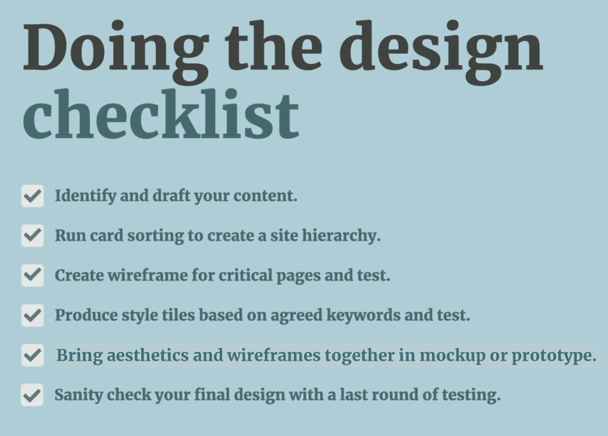
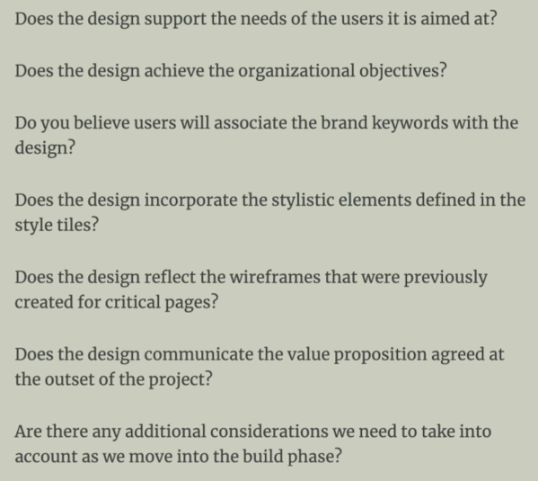

## Issues of a design process

Running a design project

- Scope creep - snowball effect, client wants more and more as the development progresses
- Subjectiveness - endless iterations, Frankenstein design
- Iteration hell

Avoiding pitfalls

- objectivity - data driven decisions
- involving client more often - providing a sense of ownership
- reassurance - providing a sense of security

Design principles

- [principles.design](https://principles.design/)
- agreeing before starting

Design process (and its issues)

- developer is forced to design without content
- design comes as a surprise
- client does not provide a quality feedback
- iterations are hard to predict
- final version looks different than the original design
- project involves a lot of risks

Speculative design

- practice of producing unpaid design work for clients to prove your skills
- potentially wasteful and costs money for everyone involved
- uninformed and not collaborative

## Improving the design process

Discovery phase

- Defining the problem being solved and the scope of the project
- Helps reduce scope creep and provides a context for the design process
- User research, interview, competitive analysis, review of existing products, etc.
- Investigation of resources, budget, and timeline
- Defining the stakeholders and their roles - finding problems vs finding solutions
- → Clear roadmap

Prototyping phase

- Establishing the direction of the design and the scope of the project
- Allows to validate design approaches and avoid costly changes later in the process
- Design mockups, wireframing, usability and aesthetic testing, etc.
- → Navigable wireframe, demo of integration of aestetics and structure

Build phase

- Turning the design into a working product
- Should involve the designer to ensure the design is implemented correctly
- Responsive design, design system, etc.
- → Developer should be able to implement the design

Live phase

- Launching the product and providing support, monitoring user behavior, and adjusting the design as needed
- At this point it is possible to observe user behavior and adjust the design accordingly (Microsoft Clarity)
- Analytics, A/B testing, heatmaps, session recording, usability testing, etc.
- → Working product with potential for further improvements

## Producing initial design

- Make client to contribute to the design process
- Separate aesthetics and structure
- Work with real content (not lorem ipsum)
- Start with navigation
- Identify the content, structure it, and then draft it
- Prioritize & organize content (hierarchy)
- Map content to the structure
- Chunk content into smaller pieces - content blocks
- Wireframing critical pages - greyscale wireframes
- User attention point exercise - identify the most important elements on the page
- Wireframing tools for early stages - balsamiq, whimsical, etc.
- 5-second test
  - what this company does?
  - is the page appealing?
  - what do you remember?
- first click test
  - investigation of a heatmap
  - is navigation intuitive?

## Design style & aesthetics

- Company style guide - colors, fonts, etc. It should be used in the first place.
- Famous person exercise - identify the person who would use the product or who represents the company (helps to understand the values of the company)
- Reseption room exercise - imagine the reception room of the company incl. furniture, interier, colors, etc.
- Brand deck exercise - participants can organize the cards into groups and then discuss the results
- Create style tiles with stakeholders, some tools that can help:
  - colors - https://picular.co/
  - google fonts
  - google images
  - dribble
- Test your style tiles with users from the target audience
- Create a high fidelity mockup → Figma → Sanity check (https://attentioninsight.com/)

## Presenting the design

- Involve stakeholders in the design process before presenting the design as much as possible
- Identify possible objections and prepare answers
- Speaking to stakeholders individually in advance
- Short video presentation of the design (examples of the design process, real use cases, etc.) - https://www.loom.com/
- Decisions, collaboration, testing - main points of the presentation to focus on
- Do not ask for immediate feedback, leave time for reflection, ask if there are any questions
- Ask own questions to the stakeholders
- Email post-presentation summary
- Control the narrative (be the only point of contact and feedback)

## Working on a design

- Keep developer in mind while working on a design
- Performance vs Perfect pixel design
- Reducing decorative elements, fonts, etc.
- Work collaboratively on interactive or visual elements - animation, accordions, carousels, etc. Budget & possibilities vs expectations.

## Creating a design system

- Start with a design system as soon as possible
- Styles:
  - typography
  - color palette
- Elements
  - buttons, fields, icons
  - navigation elements
- Components
  - header, footer, boxes, etc.
- Should evolve over time
- Could also content such as:
  - UI components
  - Content guide
  - Design principles
  - Service manual

## Post launch optimization

- Should prepare early for post-launch optimization
- An idea list - post-launch ideas, features and improvements
- Identify drop out points - where users leave the website
- Identify the problem with underperforming pages → solution → test solution
  - GA - bounce rate, exit pages + Heat maps, session recordings & eye tracking, rage clicking, on-exit surveys, etc.
- Launch and repeat
