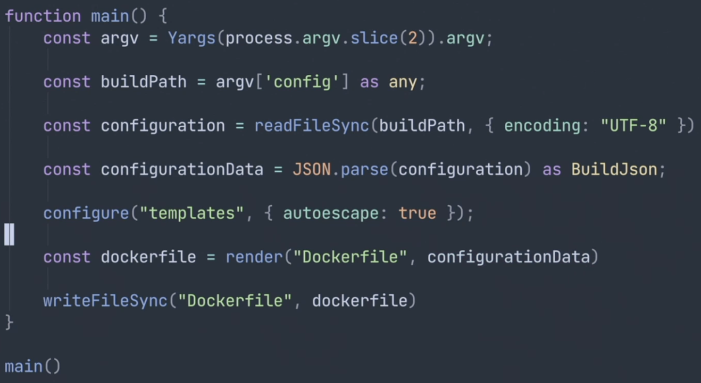

## Techical Design Document

- What problems are we trying to solve?
- What is the current process - how we do it now?
- What are the requirements?
- How do we solve the problem?

## Managing Infrastructure with Pulumi

### Infrastructure Standardization

#### Problem

We have no patterns or opinionations on how we describe services in our infrastructure

#### Services:

- Frontend
- Backend

#### Needs of services:

- Storage - Frontend
- Container - Backend
- Ingress (load balancer) - Frontend & Backend

#### What do we need?

- Simple interface for services
- Simple way of managing and updating these resources
- A way for developers to create and manage resources

### Solving the problem

Pulumi is an automation tool for managing infrastructure. We can use it to create and manage resources in AWS, Azure, GCP, and more.

- install pulumi cli (brew)
- create an account (pulumi.com)
- create a stack (aws or similar)
- create a bucket (s3)
- scale up the project (add more resources)

# CI/CD

- Docker (image)
- CircleCI (build & testing)

**_index.ts_**



**_build.json_**

```json
{
  "Name": "devops-course",
  "ServiceType": "frontend",
  "Dockerfile": {
    "InstallCommand": "RUN npm install",
    "PreInstallCommands": ["COPY myfile myfile"],
    "PostInstallCommands": ["RUN echo 'hello world'"]
  }
}
```

-> npx ts-node --transpileOnly index.ts --config "./build.json"

**_templates/Dockerfile_**

```dockerfile
FROM alpine:latest

ENV SERVICE_NAME "{{ ServiceName }}"
ENV SERVICE_TYPE "{{ ServiceType }}"


{{ command }}


RUN {{Dockerfile.InstallCommand}}


{{ command }}


RUN "/bin/bash"
```
