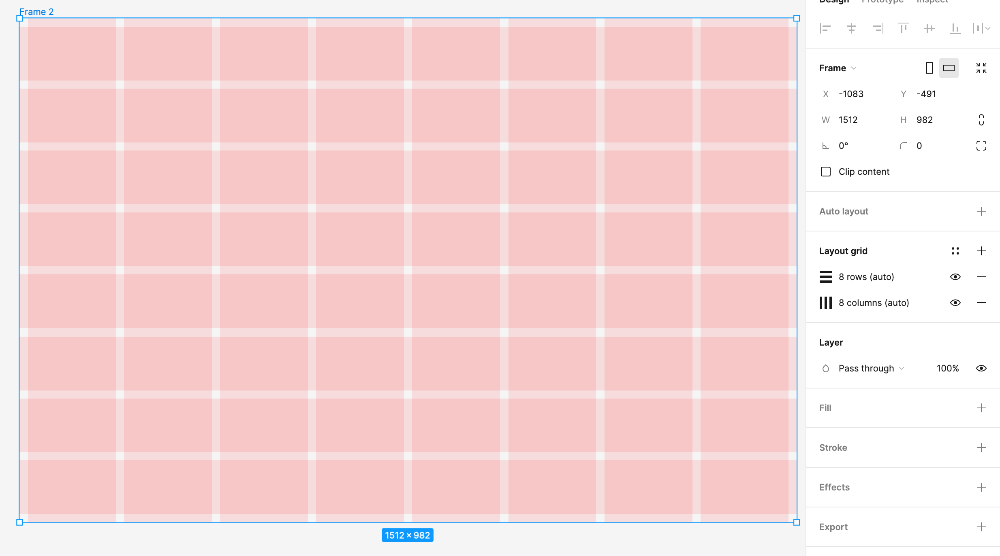
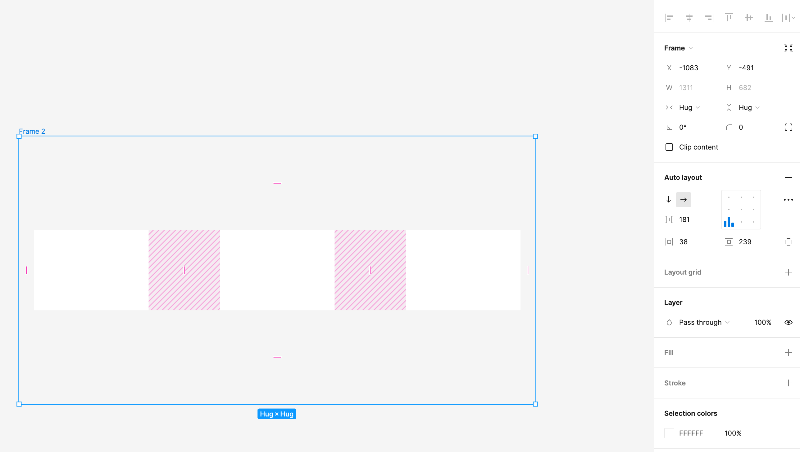

## Basic tools

- F -> frame
- R -> rectangle
- T -> text

- Space -> move view
- Shift + move -> move in certain direction
- Option + move -> duplicate (also CMD + D, creates a copy to an exact position)
- Option + hover -> show distance

- Cmd + G -> group
- Cmd + Option + G -> make frame
- Cmd + Shift + G -> ungroup (or 'unframe')

- Cmd + . -> hide sidebars
- Shift + R -> show rulers

- Shift + A -> auto layout
- Option + Cmd + K -> create component
- Sizes can be set by typing `W 100 + 15` or `H 100 - 15` or `W 150%` or `X 150 * 2` or `Y 16 / 2`

## Plugins

[Styler](https://www.figma.com/community/plugin/820660579767995949/Styler) - Generate styles from selected elements

- Select + CMD + R -> bulk rename (Brand / $n00) - creates a folder with the name and renames the selected elements

[CSSGen](https://www.figma.com/community/plugin/742750636238601912/CSSGen) - generate CSS from selected elements

[Text Styles Generator](https://www.figma.com/community/plugin/759472336242530542/Text-Styles-Generator)

[UI Color Palette](https://www.figma.com/community/plugin/1063959496693642315/UI-Color-Palette) - generate entire color palette from selected elements

## Layout Grids

- Can add multiple grids (eg. columns and rows)
- Ctrl + G -> show/hide grids

## Auto Layout

- New items can be dragged into the layout and be automatically placed
