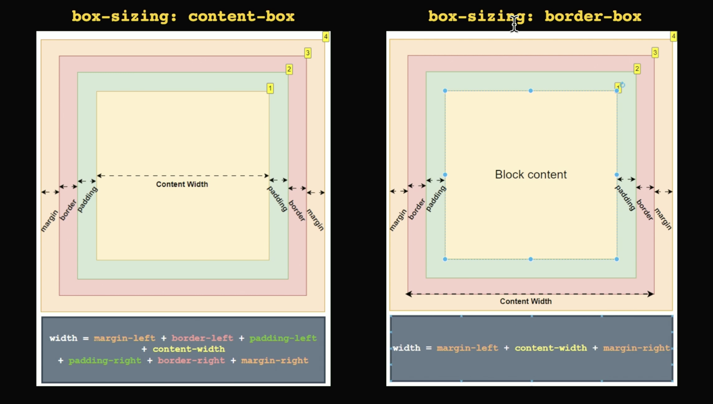
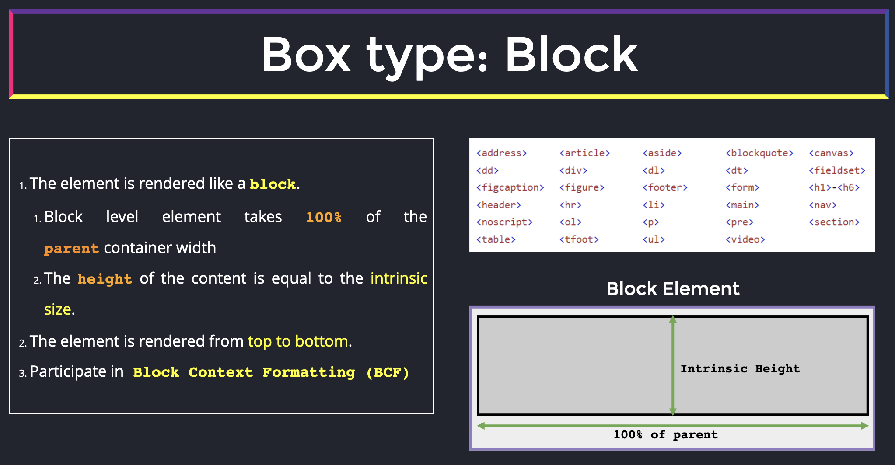
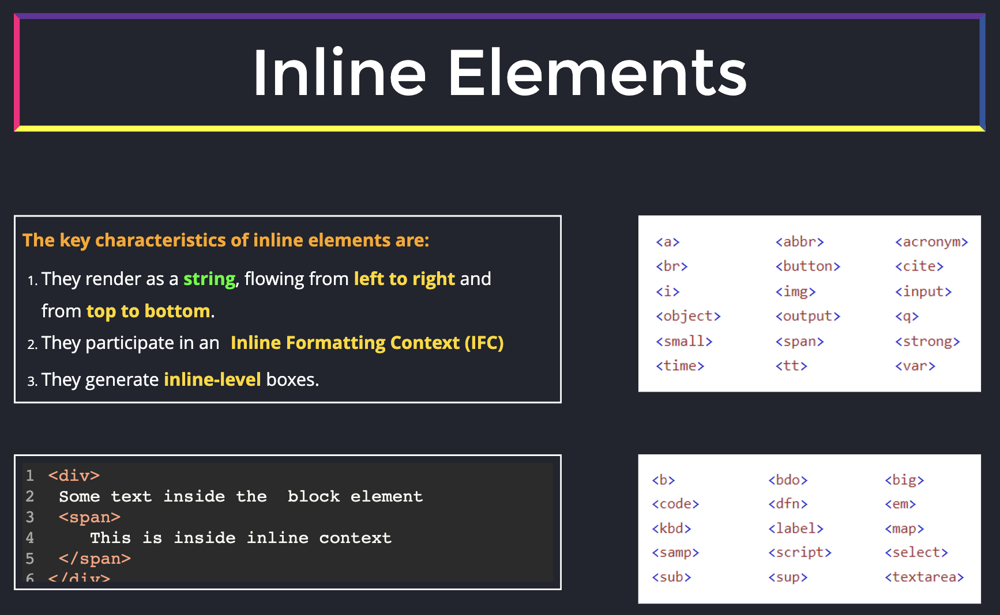
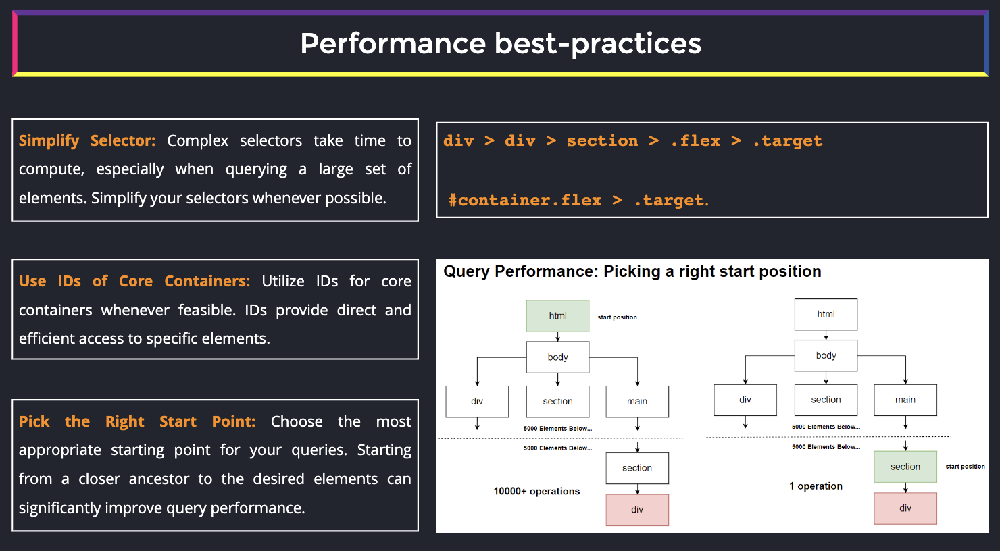
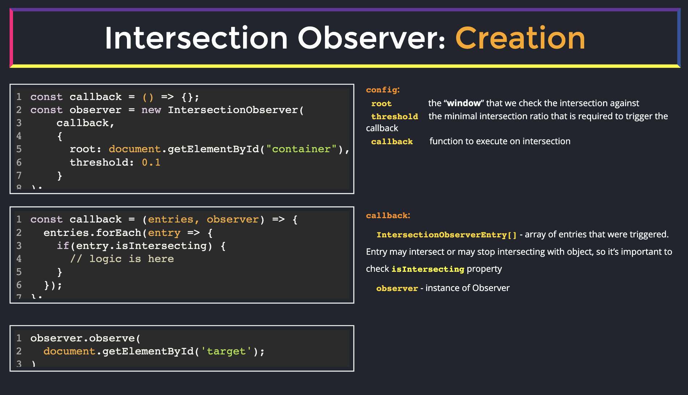
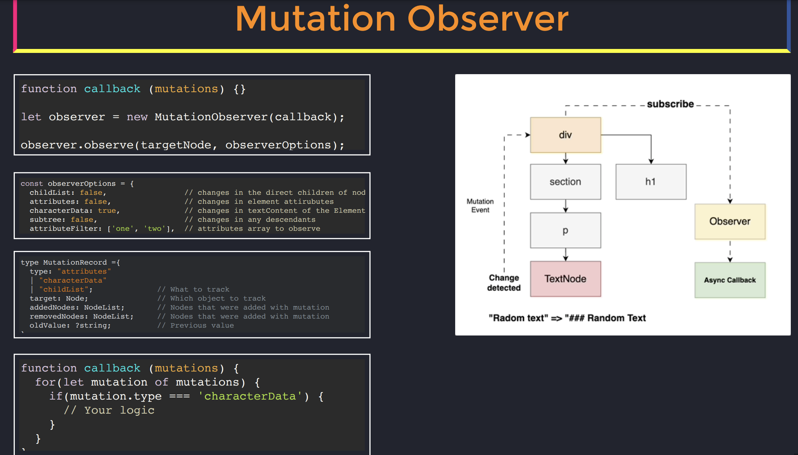
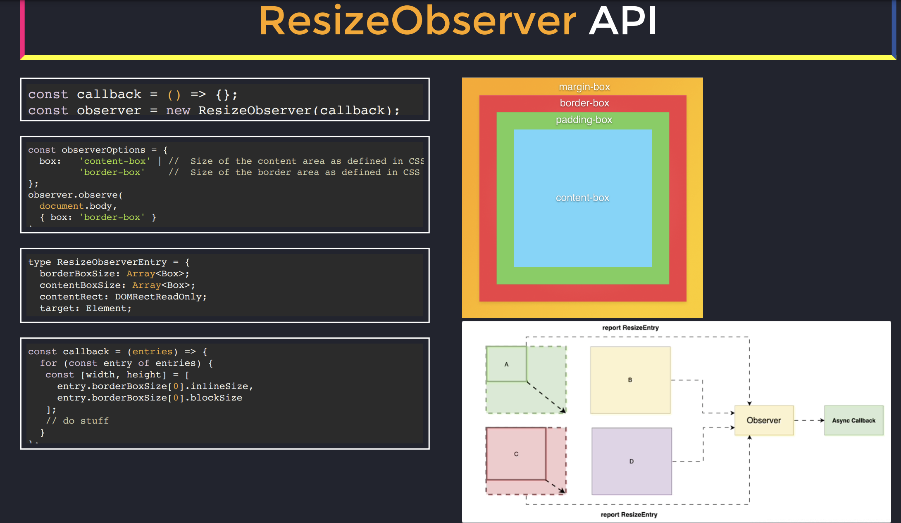
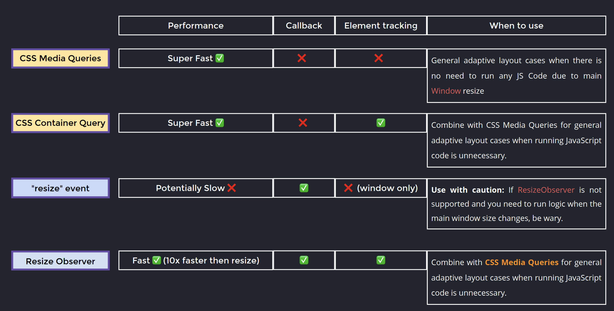

Frontend:

- API Communication
- UI Data Management
- User Interface Interactions
- Assets Management

Box model:

[CSS Triggers List – What Kind of Changes You Can Make](https://csstriggers.com/)

DOM Querying:

- getElementByID O(1) - best performance
- getElementsByClassName O(n) - slow, but low-memory overhead
- getElementsByTagName O(n) - slow, but low-memory overhead
- querySelector O(1)/O(n) - close to getElementById, slightly slower
- querySelectorAll O(n) - potentially high-memory overhead

Observer API:

