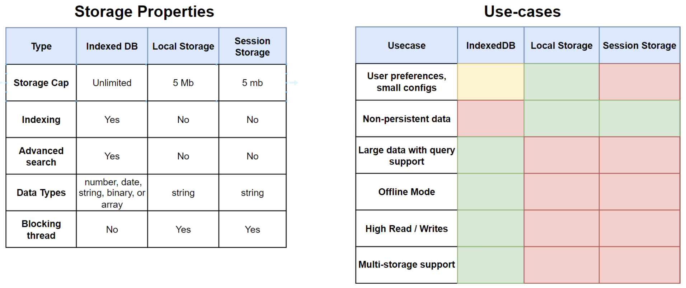

Frontend:

- API Communication
- UI Data Management
- User Interface Interactions
- Assets Management

Box model:


[CSS Triggers List – What Kind of Changes You Can Make](https://csstriggers.com/)

DOM Querying:

- getElementByID O(1) - best performance
- getElementsByClassName O(n) - slow, but low-memory overhead
- getElementsByTagName O(n) - slow, but low-memory overhead
- querySelector O(1)/O(n) - close to getElementById, slightly slower
- querySelectorAll O(n) - potentially high-memory overhead


Observer API:


Application state:

- Every field in the data object should be atomic, e.g

  ```javascript
  {
    id: 1,
    name: 'John',
    age: 25,
    job_id: "XYZ",
    job_title: "Software Engineer"
    job_description: "Developing software"
    }

    // instead of

    {
      id: 1,
      name: 'John',
      age: 25,
      job: {
        id: "XYZ",
        title: "Software Engineer",
        description: "Developing software"
      }
    }
  ```

- Data has primary keys
- Non-primary keys depend on entity primary keys


