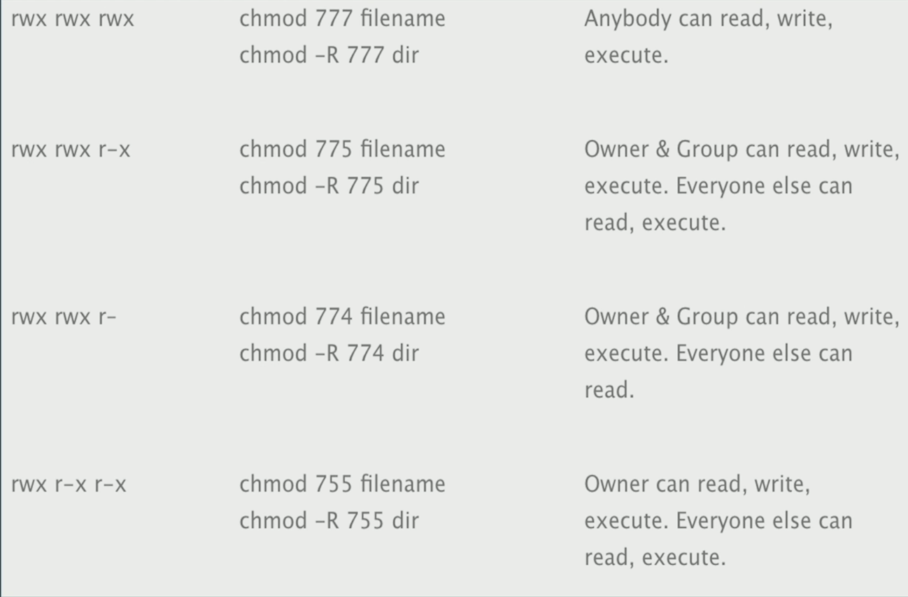

## Security

- SSH
- Firewalls
- Updates
- 2FA
- VPN

## Ports

less /etc/services - list of ports
nmap -p 1-65535 localhost - list of open ports

## Firewall

```zsh
sudo ufw status //check status
sudo ufw allow ssh //allow ssh
sudo ufw allow http //allow http
sudo ufw enable //enable firewall

sudo ufw reject http //reject http
```

## Permisions

- owner - rwx
- group - rwx
- everyone else - rwx

4 - read
2 - write
1 - execute

765 rwxrw-r-x
432 r---wx-w-



## Updates

```zsh
sudo apt install unnattended-upgrades
sudo dpkg-reconfigure --priority=low unattended-upgrades //enable automatic updates
```
