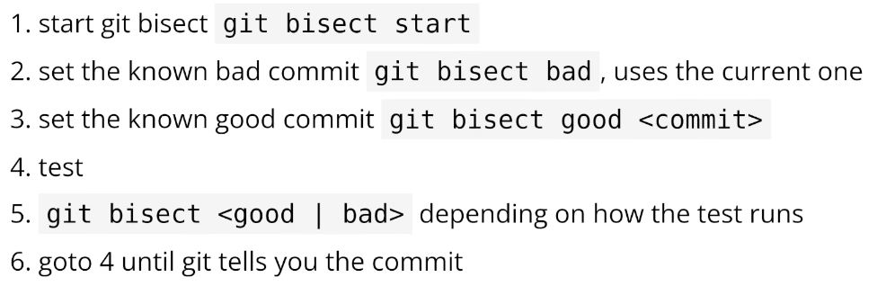
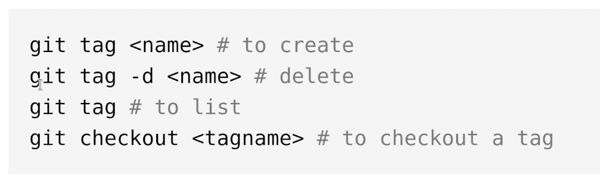

## Basic commands

```zsh
# Print the content of a commit
git cat-file -p <SHA>

# Search for a commit that contains a specific string ("mongo") and print the changes
git log -S mongo -p
```

## Git config

```zsh
git config --add user.name "Name" # Add a new user name locally
git config --global --add user.name "Name" # Add a new user name globally

git config --unset user.name # Remove the user name locally
git config --global --unset-all user.name # Remove all the user names globally
git config --remove-section user # Remove the whole user section

git config --list # List all the local configurations
git config --global --list # List all the global configurations

git config --global --list | grep user.name # List the global configurations and filter the user name
git config --get-regexp user.name # List the configurations that match the user name
git config --get user.name # Get the user name
```

## Rebase

```zsh
git checkout -b <branch> # Create a new branch and switch to it
git rebase <anotherBranch> # Rebase the current branch on top of the branch

git rebase -i HEAD~3 # Rebase the last 3 commits interactively

git config --add rerere.enabled true # Enable the reuse recorded resolution
```

## Reflog

```zsh
git reflog # Show the reflog - the history of the HEAD
git reflog -3 # Show the last 3 entries of the reflog
```

## Cherry-pick

```zsh
git reflog # Get the SHA of the commit to restore
git cherry-pick <SHA> # Apply the changes of a previously removed commit to the current branch
```

## Remote

```zsh
git init
git remote add origin <url> # Add a remote repository
git remote -v # List the remote repositories
```

## Stash

```zsh
git stash # Stash the current changes
git stash -m "Message" # Stash the current changes with a message
git stash list # List the stashes
git stash pop # Apply the last stash
git stash pop --index 3 # Apply the stash with index 3
```

## Tools & Techniques

```zsh
git log --grep foo -p # Search for specific info and show changes

git log -p -- index.js # Show the changes for a file

git revert SHA # Undo specific change with a clean history (and a new revert commit) - can be undone with reflog

git reset --soft HEAD~1 # Undo the commit but preserve the changes

git reset --hard HEAD~1 # Undo the commit and removes the changes
```




