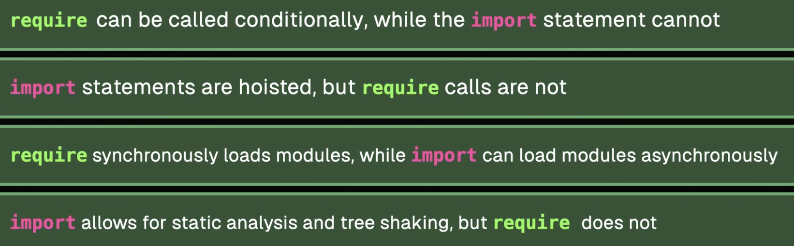

## Event Loop

The order of execution:

```js
/* 1. */ console.log("1"); // runs synchronously
/* 2. */ new Promise(() => console.log("2")); // runs synchronously
/* 3. */ (async () => console.log("3"))(); // runs synchronously - immediately invoked
/* 4. */ Promise.resolve().then(() => console.log("4")); // first from the microtask queue
/* 5. */ queueMicrotask(() => console.log("5")); // second from the microtask queue
/* 6. */ setTimeout(() => console.log("6"), 0); // last from the macrotask queue
```

## Scope & Closures

- Function envocation creates a new lexical environment.
- Variable persists in memory until the closure is destroyed.
- Hoisting in JS is the process of moving function and variable declarations to the top of the scope.
  - Variables declared with `let` and `const` are hoisted but not initialized.
  - Variables declared with `var` are hoisted and initialized with `undefined`.
  - Function declarations are hoisted and initialized with the function itself (except arrow functions).

## this

- Global context - window object in the browser, global object in Node.js.
- Regular function - object on which the function is invoked.
- Array function - lexical environment in which the function is defined.
- Classes - value of the newly created instance.
- Strict mode - `this` is `undefined` in the global context.
- Event handlers - element that received the event (e.g. button).

## Classes & Prototypes

- Creating a new class instance does not create a new copy of the methods.
- Constructors of instances of the same class share the same prototype.
- Static methods are called on the class itself, not on the instances.

## Generators & Iterators


## Modules




## Numbers

- `number++` - post-increment (returns the value before incrementing, but increments the value)
- `++number` - pre-increment (returns the value after incrementing)

## Misc

- Freezing an object makes it immutable. However, it only freezes the direct properties of the object, not the nested objects (shallow freeze).
- Splice modifies the original array, while slice, concat, and spread operator create a new array.
- Using of `delete` operator on an array does not change the length of the array. It removes the value of an element but an empty slot remains.

Operators


Dates


Symbols

