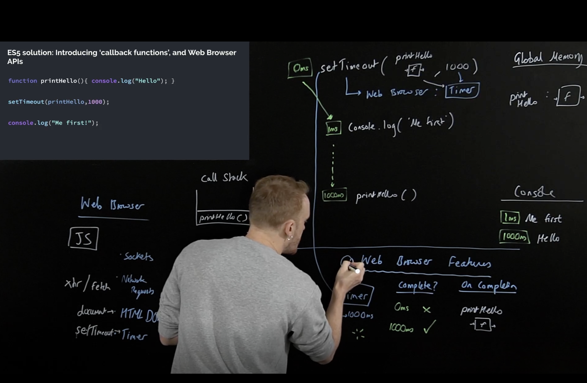

### Asynchronity in JavaScript

#### _setTimeout_ under the hood



```javascript
function printHello() {
  console.log("Hello");
}
function blockFor1Sec() {
  // blocks in the JavaScript thread for 1 second
}

setTimeout(printHello, 0);

blockFor1Sec();

console.log("Me first!");

// 0ms -> setTimeout callback printHello() is put on the callback queue
// 1ms -> blockFor1Sec() starts executing
// 1001ms -> Me first!
// 1002ms -> Hello
```

#### Promises

```javascript
function display(data) {
  console.log(data);
}

const futureData = fetch("https://twitter.com/will/tweets/1");
futureData.then(display);

console.log("Me first!");

// Promise {value: ..., onfulfilled: []}
// Me first!
// Promise {value: Response, onfulfilled: [display(Response)]}
// Twet content
```
