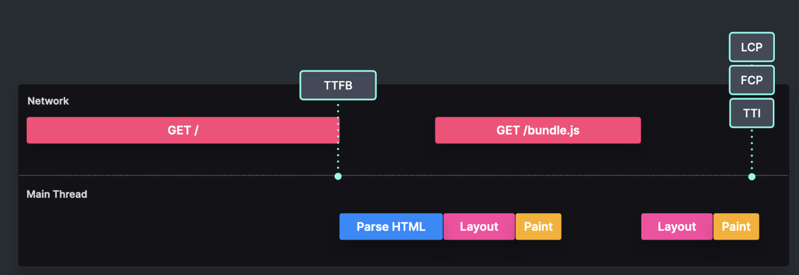

# Client side rendering

Rendering on the client side (in the browser) - during the initial page load.

**_index.html_**

```html
<html>
  <body>
    <div id="root"></div>
    <script src="/bundle.js"></script>
  </body>
</html>
```

**_bundle.js_**

```js
const root = document.getElementById("root");

// DOM manipulation
root.appendChild(...)
```



Tradeoffs:

- TTSB can be fast because an HTML file does not contain large components
- FCP, LCP, TTI - can occur later when the JS bundle is loaded, parsed and executed
- Bad option in case of large bundles, bad for SEO as well - reason for both is the time it takes to load the bundle
