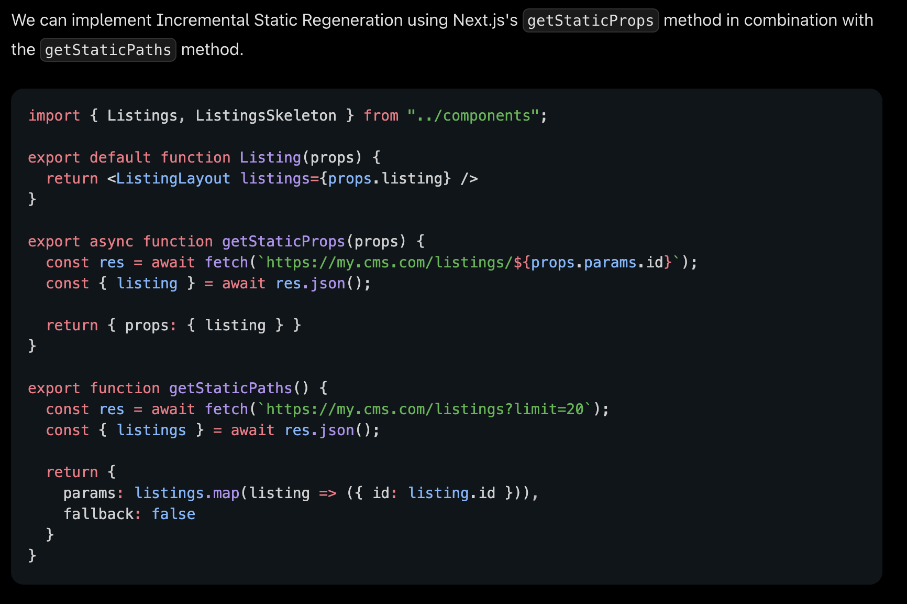
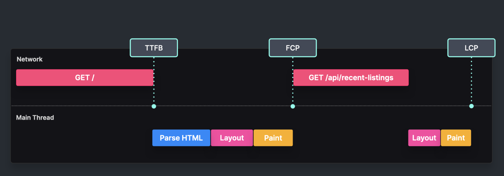

# Incremental Static Regeneration

Pre-render only the most important pages and render the rest on demand.

Implementation in Next.js:

Tradeoffs:

- Longer build times
- All static rendering benefits + FCP is faster for the most important pages
