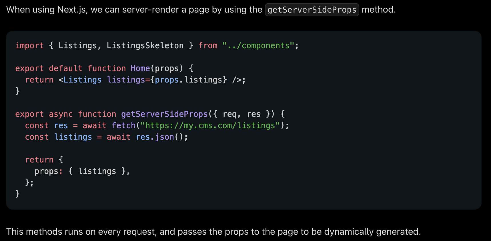

# Server-Side Rendering

Generating HTML on the server on every request.

Tradeoffs:

- Slower TTBF because the page needs to be generated on the server every time
- All other metrics are average
- Good for dynamic content, otherwise should be avoided
