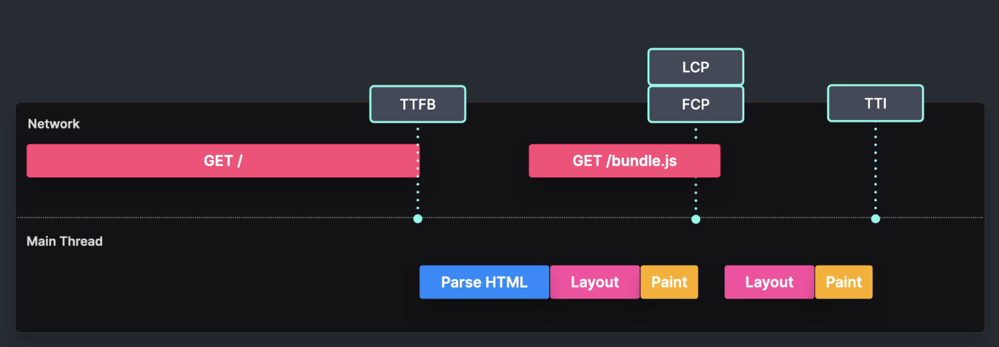

# Static rendering

Content is a pre-rendered HTMl which was generated at build time.

Widely used in static site generators like Gatsby, Next.js, Nuxt.js, etc.

Tradeoffs:

- TTFB is fast because an HTML file does not contain large components
- Faster LCP and FCP because the HTML file is already pre-rendered
- However TTI can be as slow/fast as in client rendering case because it loads the JS bundle needed for hydration
