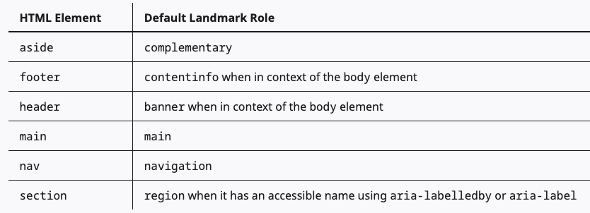

Section on its own does not have semantic meaning. It can be added with a aria-label or aria-labelledby attribute.

```html
<section aria-labelledby="sectionHeading">
  <h2 id="sectionHeading">Join the mailing list</h2>
  <p>This is the section content</p>
</section>
```

[A blog post with every HTML element](https://www.patrickweaver.net/blog/a-blog-post-with-every-html-element/#footnote-1-link)
