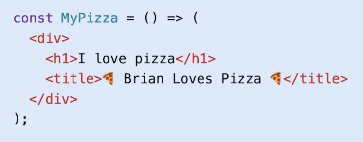
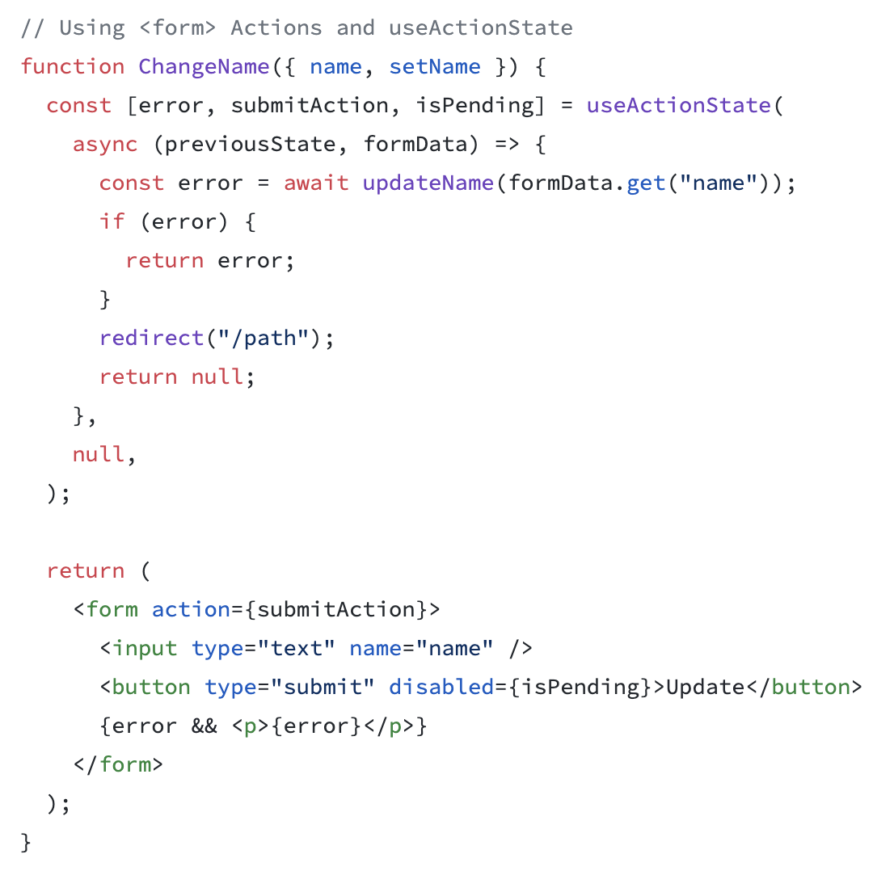

[React 19 update notes](https://react.dev/blog/2024/12/05/react-19)

### Directives
Directives below are relevant in environments that support React Server Components (RSC), such as Next.js.
- "use client"
  - means that the component will be rendered entirely in the browser.
  - https://react.dev/reference/rsc/use-client
- "use server"
  - means that the component will be rendered on the server (default behavior in Next.js)
  - https://react.dev/reference/rsc/use-server

### Document metadata
- React 19 supports `<link>`, `<meta>` and `<title>` tags in the head of the document


### Browser Resource Hints: preload, prefetch, and preconnect
[Resource Hints](https://www.debugbear.com/blog/resource-hints-rel-preload-prefetch-preconnect)

### Form actions


useFormStatus hooks helps to pass the state of the form to children components

```jsx
import {useFormStatus} from 'react-dom';

function DesignButton() {
  const {pending} = useFormStatus();
  return <button type="submit" disabled={pending} />
}
```

### use & Suspense

`use` hook is used to read the value of a promise

```jsx
// const fetchPosts = () => fetch('/posts').then(res => res.json());
// const postsPromise = fetchPosts();

import {use} from 'react';

function Posts({postsPromise}) {
  const posts = use(postsPromise);
  return posts.map(post => <p key={post.id}>{post}</p>);
}

function App({postsPromise}) {
  return (
    <Suspense fallback={<p>Loading...</p>}>
      <Posts postsPromise={postsPromise} />
    </Suspense>
  );
}
```

### React compiler

Eliminates the need for using `useMemo` and `useCallback` hooks

### ref

`ref` can be now passed as a prop to a component without using `forwardRef`

```jsx
function MyComponent({ref}) {
  return <div ref={ref} />;
}
```

### Context

Context doesn't need to be wrapped in a provider anymore

```jsx
const ThemeContext = createContext('');

function App({children}) {
  return (
    <ThemeContext value="dark">
      {children}
    </ThemeContext>
  );
}
```
