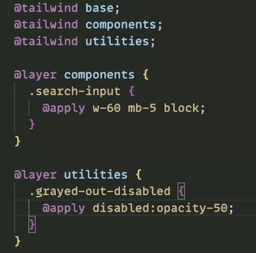

## An extremely ugly way to handle CSS in React

- npm i -D tailwindcss postcss autoprefixer
- npx tailwindcss init -p
- Tailwind Css Intellisense - VSCode extension
- npm install -D prettier-plugin-tailwindcss

**_styles.css_**

```css
@tailwind base;
@tailwind components;
@tailwind utilities;
```

**_App.jsx_**

```jsx
<div className="p-7 text-center mb-10 w-full bg-gradient-to-b from-yellow-400 via-orange-500 to-red-600">
  <h1 className="text-4xl font-bold text-white hover:text-gray-200">
    Hello World
  </h1>
</div>
```

## For styling forms

npm install -D @tailwindcss/forms@0.5.3 (add also to tailwind.config.js)

## Extending Tailwind


