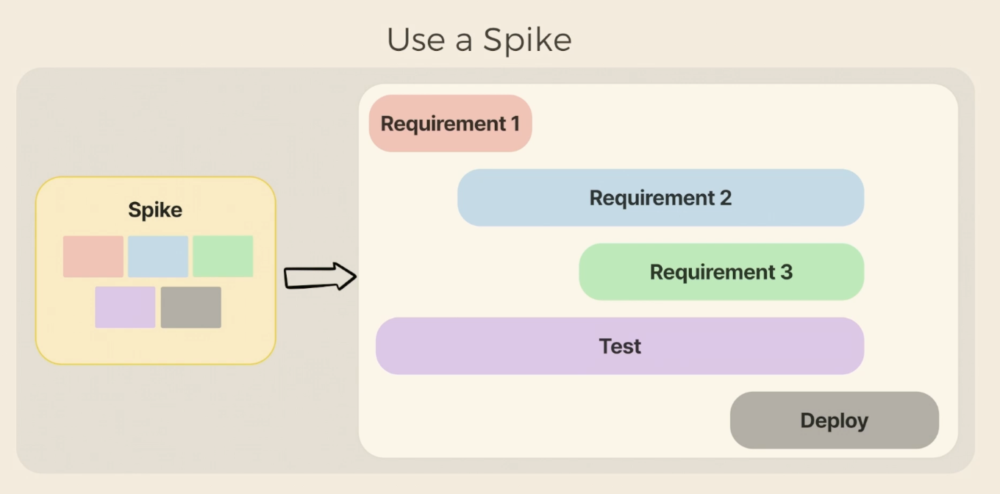

## Time estimation

- Spike - more agile way compared to the waterfall model
  
- Practicing breaking down tasks into smaller tasks and estimating them
- Gathering information & communication

## Growth

- Self assesment (continuous)
- Surfacing your accomplishments
  - Brag doc - keep track of your progress
- Opportunities -> building relationships (trust)
