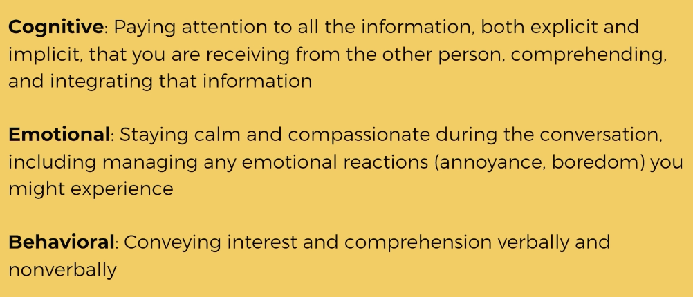
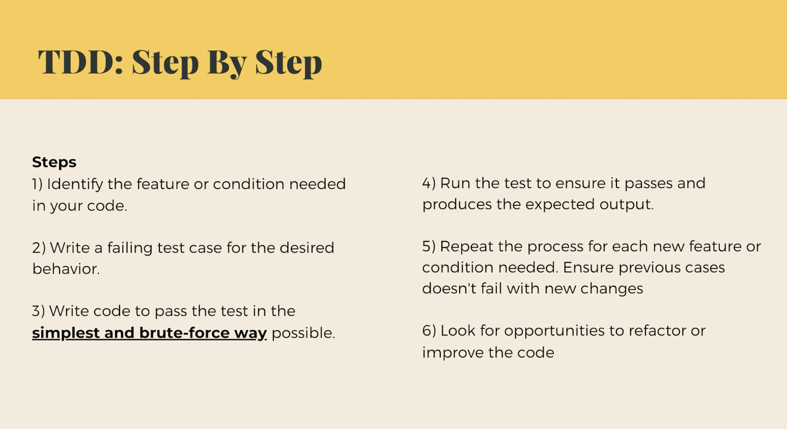
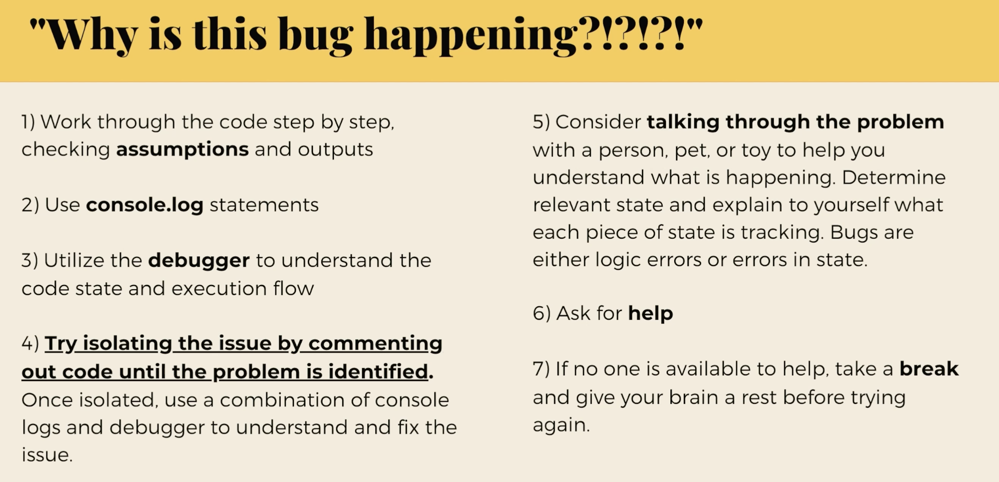

## Time estimation

- Spike - more agile way compared to the waterfall model
  
- Practicing breaking down tasks into smaller tasks and estimating them
- Gathering information & communication

## Growth

- Self assesment (continuous)
- Surfacing your accomplishments
  - Brag doc - keep track of your progress
- Opportunities -> building relationships (trust)

## Communication

- Active listening
  
- Mirroring
- Label emotions

## TDD

- Code changing is safer, solutions are more robust, and the code is more maintainable
- Should be integrated into the development process
- Common pitfalls - done as an afterthought, testing the wrong thing, overly concerned with code coverage
- VS Code Debugger vs console.log

