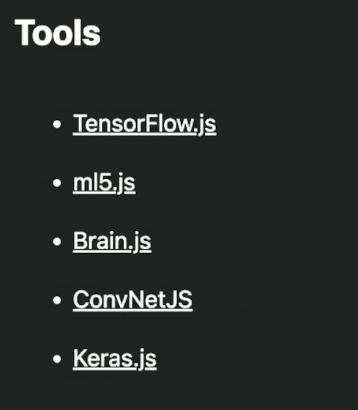
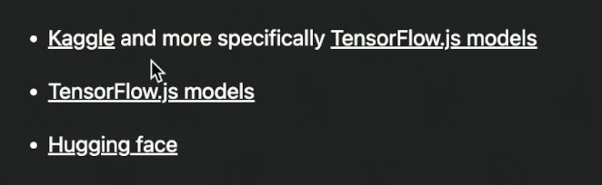
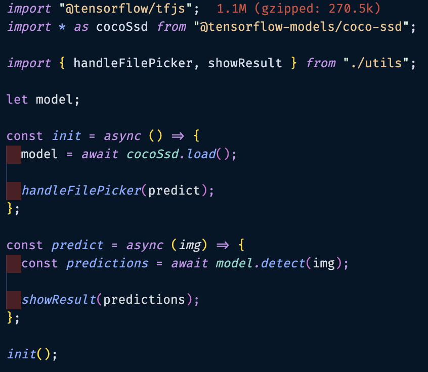
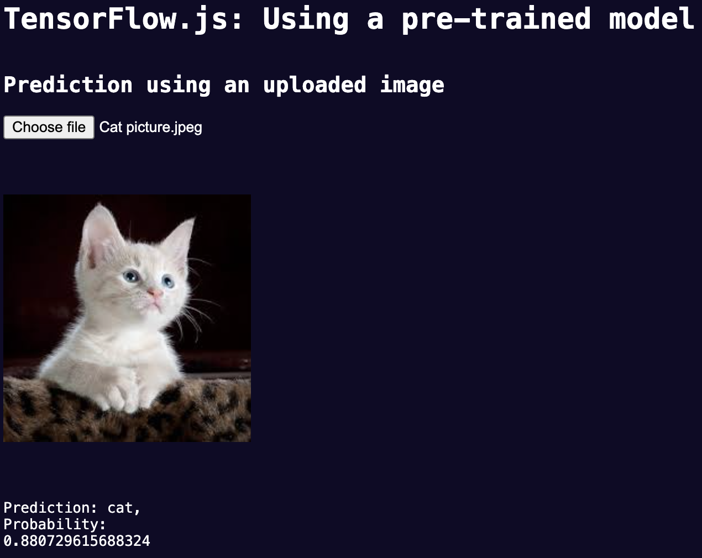

## ML JS Tools

## Pre-trained Models

## Example of using a pre-trained model

## Example projects

- [Image detection](./fem-ml-workshop/exercises/project-1/)
- [Webcam detection](./fem-ml-workshop/exercises/project-2/)
- [Face classification](./fem-ml-workshop/exercises/project-3/)
