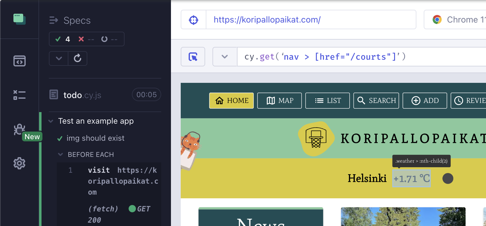

# Testing Web Apps with Cypress

## Set Up

### Install & Run

- npm i cypress --save-dev
- npx cypress open
- OR package.json -> "cypress": "cypress open" -> npm run cypress
- OR npx cypress run (for CLI) -> package.json -> "cy:run": "cypress run" -> npm run cy:run

### Selectors

Cypress inner tool can be used to help to get the selector of the element



## Cypress Studio

cypress.config.js

```js
{
  e2e: {
    experimentalStudio: true;
  }
}
```

## CI

[Docs](https://github.com/stevekinney/cypress/blob/main/lessons/Continuous%20Integration%20and%20Cypress%20Dashboard.md)
