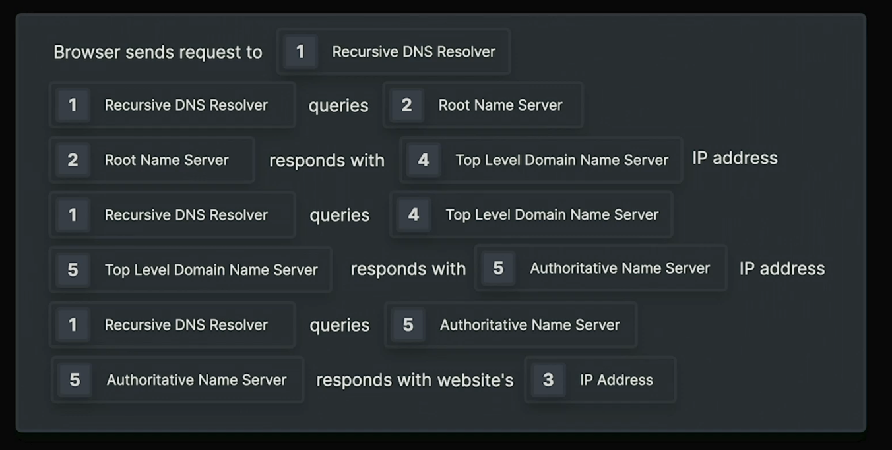

1. Async & Defer

   - Normal script loading:
     
   - Async script loading:
     
   - Defer script loading:
     

2. Rendering pipeline & Compositing
   Dom & CSSOM -> Render Tree -> Layout -> Paint -> Composite

3. Resolving domain request
   

4. Resource loading
   

   - Normal network resource loading:
     DNS -> TCP -> TLS -> Request -> Response
   - DNS Prefetching:
     DNS -> **Fetching** -> TCP -> TLS -> Request -> Response
   - Preconnect:
     DNS -> TCP -> TLS -> **Fetching** -> Request -> Response
   - Prefetching:
     Means that the browser will download the resource as soon as possible, but not execute it. It will be stored in the cache and will be executed when the browser thinks it's the right time.
   - Preloading:
     Browser will also download the resource as soon as possible, but execute it as soon as it's downloaded. It will be stored in the cache and will be executed when the browser thinks it's the right time.

5. Cache directives
   
