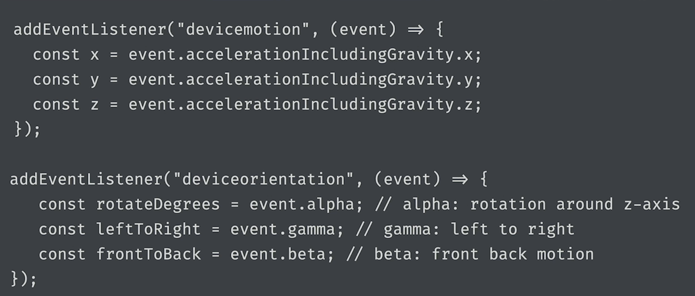
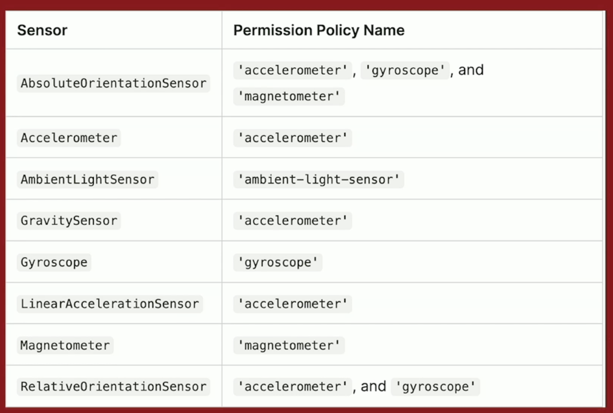
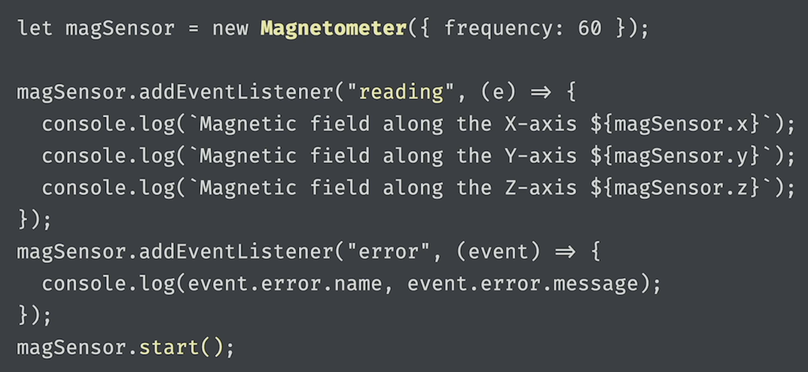
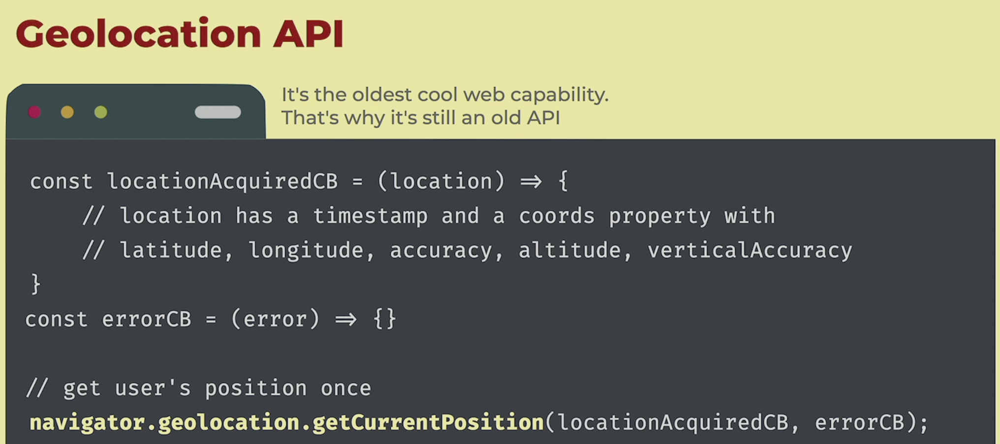
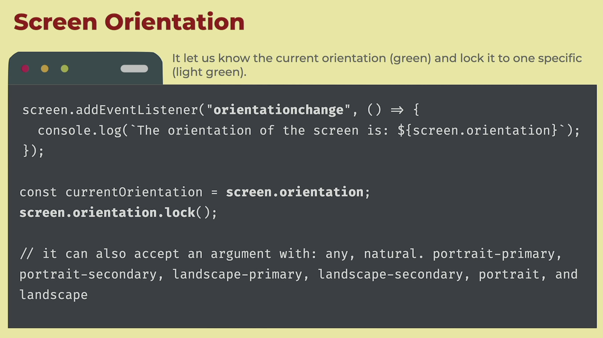
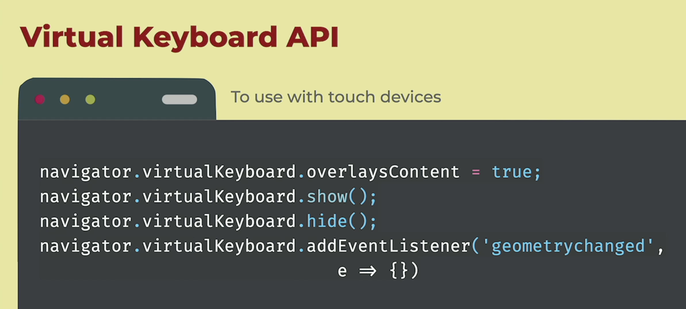
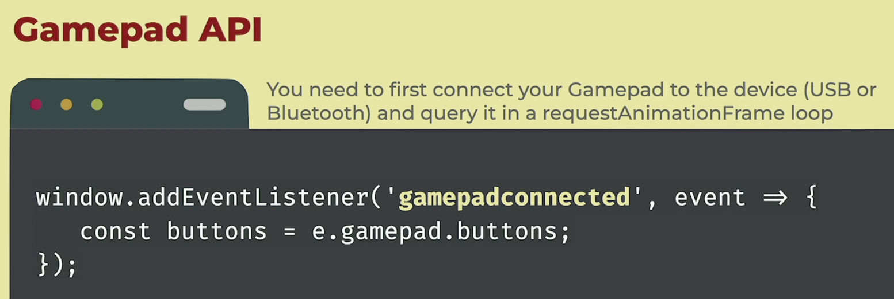
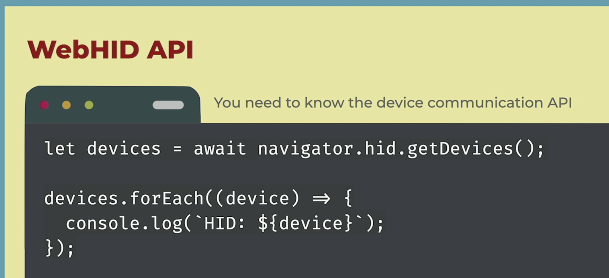
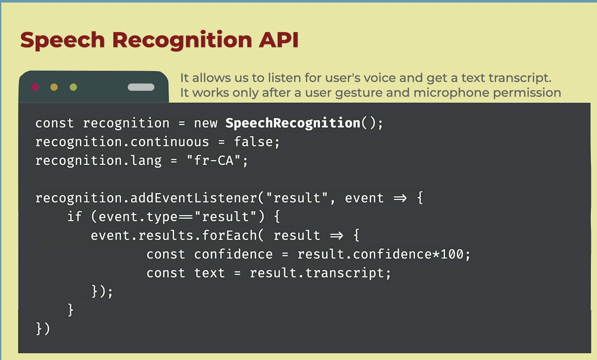
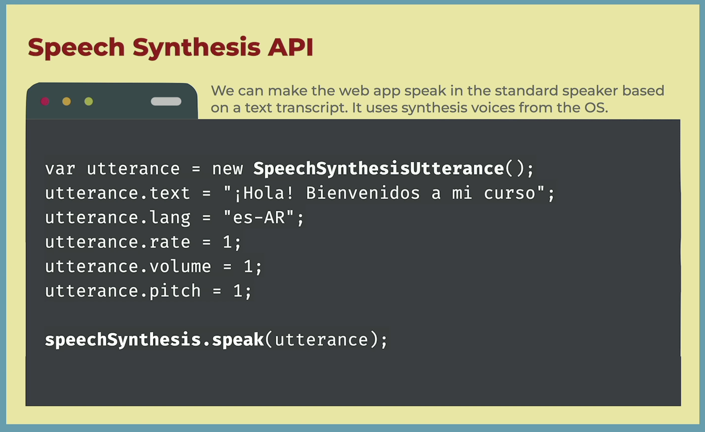

## Web Capabilities

### Tools and Resources

- [Chrome Origin Trials](https://developer.chrome.com/origintrials/#/trials/active)
- [Mozilla Developer Resources](https://developer.mozilla.org/)
- [Can I Use](https://caniuse.com/)
- [Web.dev](https://web.dev/)
- [WebKit Blog](https://webkit.org/blog/)
- [Chrome Status](https://www.chromestatus.com/)

### Sensors

- Accelerometer (motion and gravity)
- Gyroscope (orientation)
- Magnetometer (compass)
- Proximity (distance)
- Light
- Humidity, altitude, temperature, etc.
  -> Can be used with global (old) DOM APIs or Sensor APIs
  - DOM
    
  - Sensor
    
    

### Geolocation

- Needs user permission
- Works only in the foreground
- Not suitable for geofencing
- getCurrentPosition (takes 2 cb) or watchPosition (takes 3rd arg object - timeout, maximumAge and enableHighAccuracy)
  

### Orientation, touch and virtual keyboard



- Touch events (only for touch screens)
  - touchstart, touchmove (drag), touchend, touchcancel
- Pointer events (mouse, touch, pen, stylus, etc.)
  - pointerdown, pointermove, pointerup, pointercancel



### Gamepad & WebHID API





### Speech Recognition



### Speech Synthesis



### Shape & Face Detection

Currently only supported on Android

```js
const barCode = new BarcodeDetector();
const face = new FaceDetector();
const text = new TextDetector();

const barCodeResults = await barCode.detect(image);
const faceResults = await face.detect(image);
const textResults = await text.detect(image);

console.log(barCodeResults);
console.log(faceResults);
console.log(textResults);
```

### External Hardware & Devices

- Web Bluetooth API (chrome)
- Web Audio & Web MIDI
- Web Serial & Web USB
- Vibration (chrome + android), Battery Status (chrome, edge, opera) & Idle Detection
- Web NFC (chrome)

### OS Integration

- PWA
- Multi-Screen Windows Placement, Windows Controls Overlay
- File & URL Protocol Handler
- Web Share
- Smart App Banner
