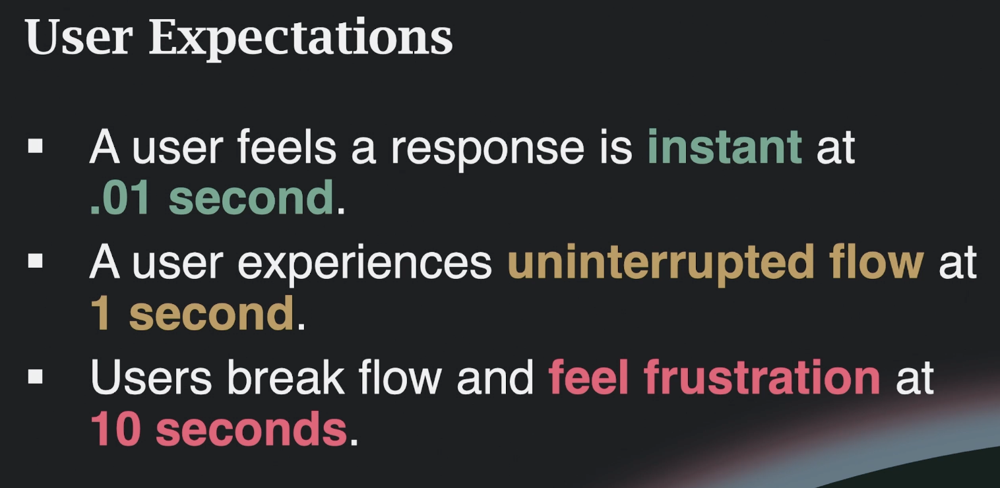
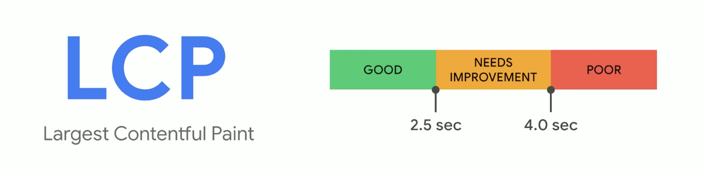
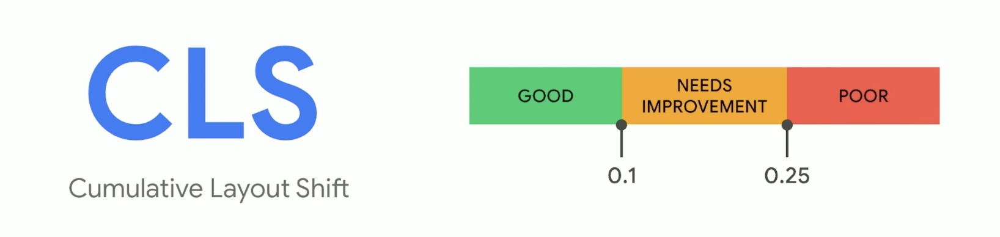
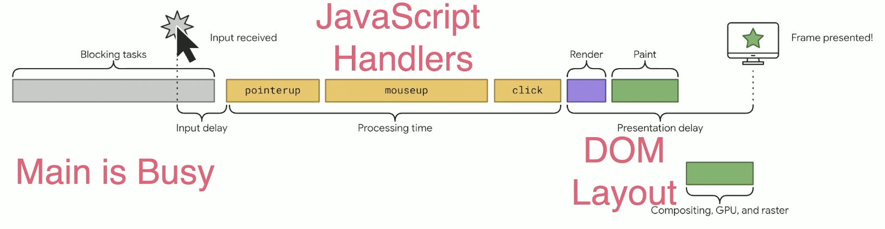
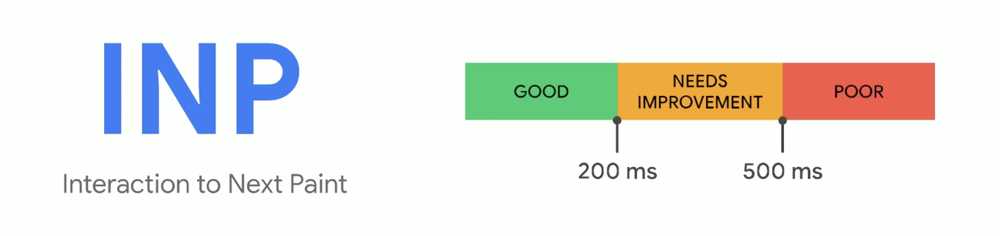
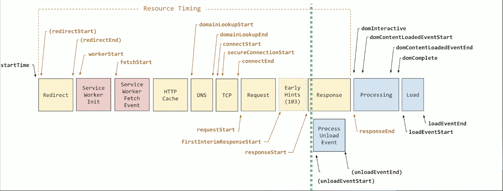
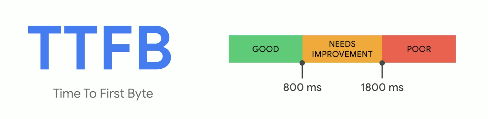
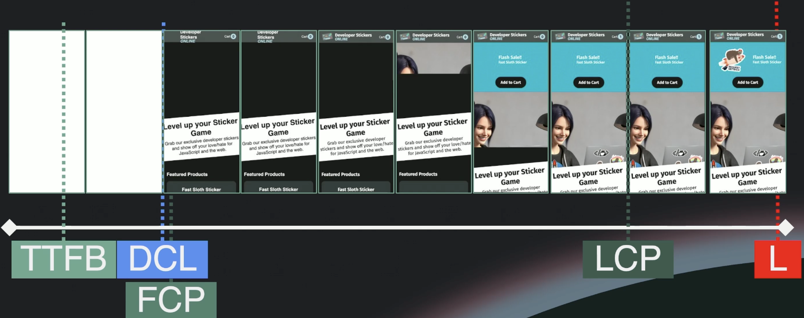
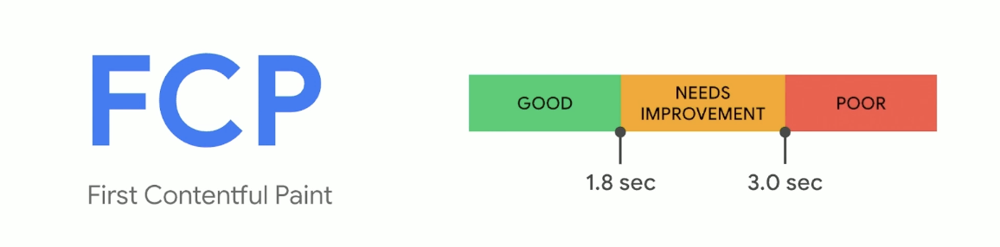

As a result:

- **40% of users** abandon a website that takes more than **3 seconds** to load
- **75% of users** will not return to sites perceived as slow
- Low Core Web Vitals result in lower SEO rankings

### Legacy Metrics

- Waterfall charts - show how long each type of resource takes to load
- DOMContentLoaded (DCL) - the HTML donwloaded, parsed and deferred scripts are executed, images/media may still be loading
- Load event (L) - all resources have been downloaded and rendered (except lazy-loaded resources)
- The problem - legacy metrics are not applicable to modern web applications (SPA, SSR, PWA, etc.)

## Core Web Vitals (LCP, CLS, INP)

### Largest Contentful Paint (LCP)

- how fast the most important (= largest by area) content loads
- ``, `<video>`, css:background-image, text elements (opacity > 0, size < 100%)
- calculation stops after first user interaction (click, key press, etc.)
  

### Cumulative Layout Shift (CLS)

- measures the visual stability and predictability of a page load
- applies to both height and width changes
- does not icnlude shifts from user actions (< 500ms)
  

### Interaction To Next Paint (INP)

- measures how quickly users can interact with a page
- click, drag, touch, keypress, <u>but not</u> scroll
- takes multiple user interactions into account and uses the worst case
- heavily influenced by device performance
  
  

#### First Input Delay (FID) - not a Core Web Vital anymore (2022-2024)

- was replaced by Interaction To Next Paint (INP)

### Time To First Byte (TTFB)

- how quickly the server responds to a request
- affects LCP
  
  

### First Contentful Paint (FCP)

- how quickly the <u>first</u> content is rendered
  
  
